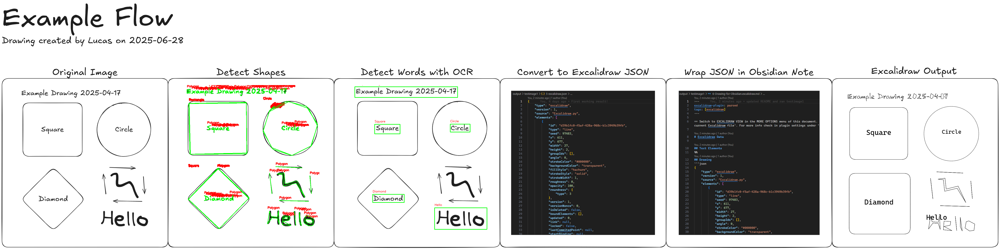

# Python Script to convert images into Excalidraw diagrams


I created this project to be able to take photos of system architectural diagrams I've drawn in my notebooks or on whiteboards and convert them into Excalidraw diagrams. This allows me to easily edit them and share them with others digitally.

**Process Overview**
1. Convert image to threshold version for line and shape detection with OpenCV
2. Detect shapes with OpenCV
3. Use OCR to extract text and bounding boxes
4. Convert to Excalidraw JSON format
5. Save as Obsidian Excalidraw Markdown file

# Setup Instructions
Create a virtual environment
```bash
python -m venv .venv
```
Activate the virtual environment (Below command is for Windows)
```bash
.venv\Scripts\activate.bat
```

Install the following packages:
- pip install opencv-python
- pip install Pillow
- pip install easyocr
- pip install Excalidraw-Interface
  - https://pypi.org/project/Excalidraw-Interface/

## Run the script
1. Edit the script `image-to-excalidraw.py` to set the path to your image file.
   - Change the `image_path` variable to point to your image file.
   - Example: `image_path = 'path/to/your/image.png'`
2. Run the script
```bash
python image-to-excalidraw.py
``` 
